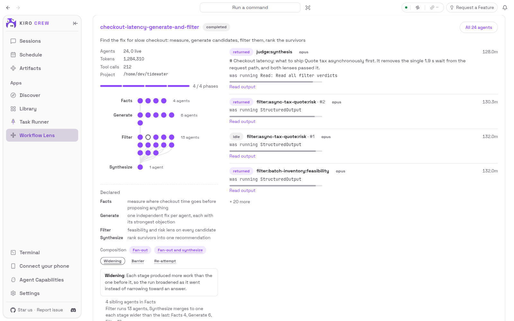

# Workflow Lens

**Make Claude Code's dynamic workflows visible as they happen.** Follow progress,
understand workflow patterns, and read individual subagent outputs. This
[KiroCrew](https://github.com/kirodotdev/KiroCrew) app reads the artifacts Claude Code
writes to disk, making work that is usually opaque easier to follow and learn from.
Live views refresh from those artifacts; they are not a token-by-token stream.



The runs in these screenshots are invented for illustration.

## Who it is for

**Anyone whose Claude Code sessions run dynamic workflows**, whether started from the
Claude Code CLI or from a KiroCrew session backed by Claude. The app reads the
artifacts Claude Code writes under `~/.claude/projects` on the gateway's machine, so
on a machine with no workflow runs the page is empty.

## When to use it

- **Follow work while it happens.** While Claude runs a workflow, see which phases
  and subagents are active and read available outputs as work progresses.
- **Learn how workflows work.** Explore a run's patterns and the evidence behind
  them, from fan-out and pipelines to repeated attempts.
- **Look beyond the final summary.** Read individual subagent outputs to compare
  their answers and understand how the workflow reached its conclusion.
- **Try a pattern yourself.** Choose a shape, add your task, and open the prepared
  prompt in the chat composer or copy it to a workflow-capable Claude session.

## What it shows

- **Phases and agents** — a diagram of each phase and its agents, with live agents
  pulsing and stopped agents filled or hollow by whether they returned a result.
- **Declared plan** — what each phase was declared *for*, kept visibly apart from
  everything the run actually did.
- **Shape** — the composition the run evidences, each claim with the evidence line
  that produced it. Tap a chip for what it means.
- **Outputs** — the run's final result and each agent's own answer, rendered as
  markdown and fetched only when opened.
- **Launchers** — start a new workflow in a chosen shape, with the task filled in or
  the prompt copied.

## Walkthrough: compare ideas, then inspect the reasoning

With the app installed and a workflow-capable Claude Code session available:

1. Open **Start a workflow** and enter a task such as: "Propose three ways to make
   a small project's README clearer. Compare their tradeoffs and recommend one.
   Do not edit files."
2. Choose **Fan-out and synthesize** and select **Use this shape**. Review the
   prepared prompt in the chat composer before sending it to a Claude-backed
   session. Alternatively, use **Copy prompt** in a workflow-capable Claude Code
   session on the same machine as the gateway.
3. Once Claude starts the workflow and writes its artifacts, find the run in
   Workflow Lens. Follow the active phases and subagents as the view refreshes.
4. Open the shape chips to learn what each pattern means and which observations
   support it. The declared plan is shown separately from what actually happened.
5. Use **Read output** on individual agents as their answers become available.
   Compare those proposals with the final output once the workflow finishes.

The launcher prepares a prompt; it does not execute the workflow or add workflow
capabilities to a session. Only outputs present in Claude Code's artifacts can be
shown.

## How a shape is decided

Two readings of the same artifacts, and every claim names what produced it:

- **Membership** — which agents ran in which phase: fan-out, tournament,
  classify-and-act, adversarial verification, the merge, widening.
- **Journal order** — when each agent started relative to the others returning:
  pipeline, barrier, re-attempt, rolling.

A shape the artifacts do not evidence is not claimed. Tree of thought can be started
from a launcher but is never detected, because no run has yet shown one.

The composition names come from the
[claudefa.st guide to Claude Code dynamic workflows](https://claudefa.st/blog/guide/development/ultracode-dynamic-workflows-agent-teams).
`pipeline` is a function of the Workflow script API; barrier, re-attempt, rolling and
widening are this app's own.

## Install

**Before you install:** the app has a Python backend that runs inside the gateway,
and KiroCrew refuses third-party executable code unless you allow it. Set this in
`~/.kiro/crew/config.json`:

```json
{ "agent": { "apps_allow_third_party": true } }
```

Without it, enabling the app fails with `app_execution_denied`.

Install from the App Store, or from a local clone:

```bash
git clone https://github.com/Premshay/kirocrew-workflow-lens.git
kirocrew app install ./kirocrew-workflow-lens
kirocrew app enable workflow-lens
```

The app is read-only: every route answers from disk, it makes no network calls, and
it declares no storage.

## Known limits

- **Backend changes do not load on a file copy.** The gateway caches an app's Python
  for its process lifetime. After updating `backend/`, touch the files and run
  `kirocrew app disable workflow-lens && kirocrew app enable workflow-lens`. UI changes
  need no reload.
- **Older runs report less.** Runs written before Claude Code recorded a phase on each
  journal event carry no phase attribution, so their shape reads as fan-out at most.
- **A run still in progress has no totals.** Claude Code writes token and tool-call
  counts when a run stops, so a live run shows them as not counted yet.

## Tests

The route tests import `aiohttp` and `kiro_crew`, so run them with KiroCrew's
environment:

```bash
/path/to/KiroCrew/.venv/bin/python -m pytest tests/ -q
```

## License

[MIT](LICENSE)
